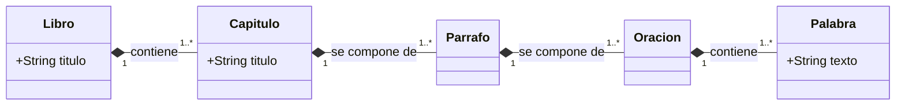
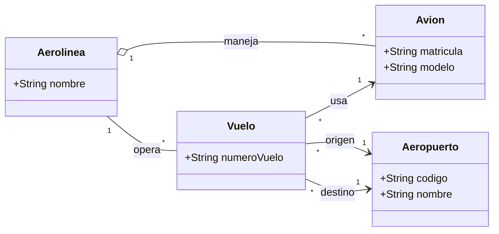
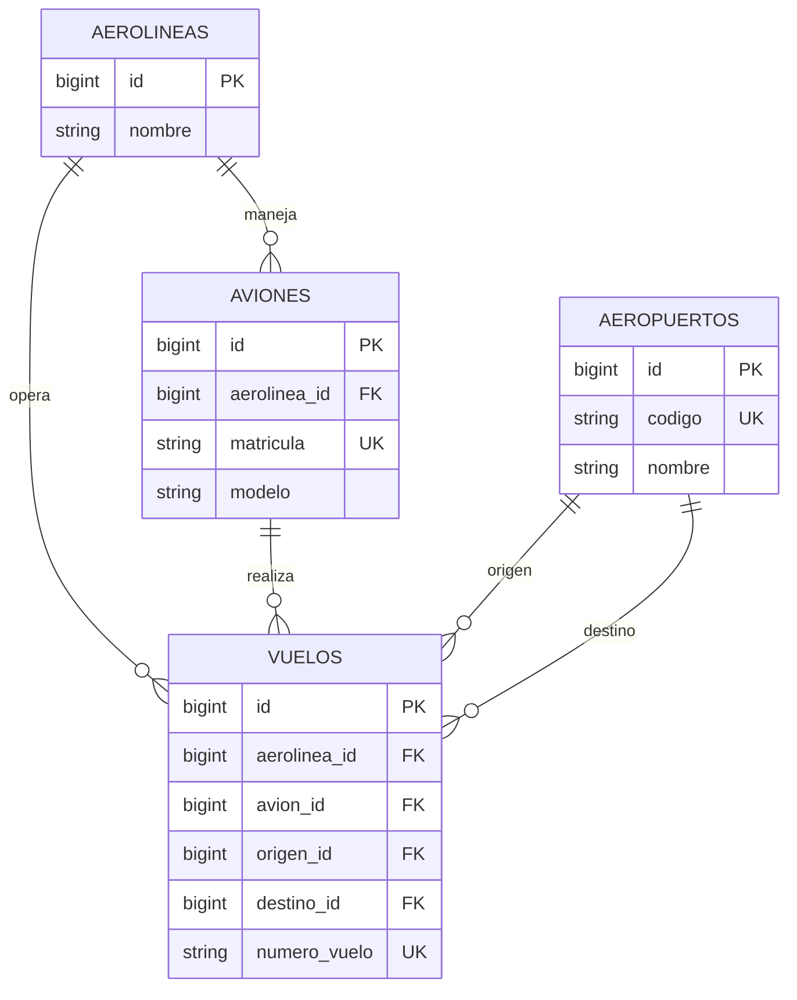

# Ejercicio 1: Libro (composición)

```mermaid
classDiagram
    direction LR

    class Libro {
        +String titulo
    }
    class Capitulo {
        +String titulo
    }
    class Parrafo
    class Oracion
    class Palabra {
        +String texto
    }

    Libro "1" *-- "1..*" Capitulo : contiene
    Capitulo "1" *-- "1..*" Parrafo : se compone de
    Parrafo "1" *-- "1..*" Oracion : se compone de
    Oracion "1" *-- "1..*" Palabra : contiene
```

# Ejercicio 2: Aerolínea (asociaciones)

## Diagrama de clases

```mermaid
classDiagram
    direction LR

    class Aerolinea {
        +String nombre
    }
    class Avion {
        +String matricula
        +String modelo
    }
    class Vuelo {
        +String numeroVuelo
    }
    class Aeropuerto {
        +String codigo
        +String nombre
    }

    Aerolinea "1" o-- "*" Avion : maneja
    Aerolinea "1" -- "*" Vuelo : opera
    Vuelo "*" --> "1" Avion : usa
    Vuelo "*" --> "1" Aeropuerto : origen
    Vuelo "*" --> "1" Aeropuerto : destino
```

## Diagrama entidad-relación

```mermaid
erDiagram
    AEROLINEAS {
        bigint id PK
        string nombre
    }
    AVIONES {
        bigint id PK
        bigint aerolinea_id FK
        string matricula UK
        string modelo
    }
    AEROPUERTOS {
        bigint id PK
        string codigo UK
        string nombre
    }
    VUELOS {
        bigint id PK
        bigint aerolinea_id FK
        bigint avion_id FK
        bigint origen_id FK
        bigint destino_id FK
        string numero_vuelo UK
    }

    AEROLINEAS ||--o{ AVIONES : "maneja"
    AEROLINEAS ||--o{ VUELOS : "opera"
    AVIONES ||--o{ VUELOS : "realiza"
    AEROPUERTOS ||--o{ VUELOS : "origen"
    AEROPUERTOS ||--o{ VUELOS : "destino"
```